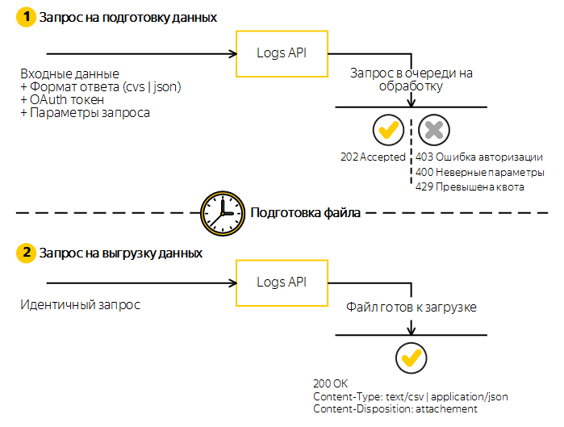

# AppMetrica Logs API

## Запрос


AppMetrica Logs API принимает запрос и помещает его в очередь для обработки.
Если запрос обработан корректно, AppMetrica подготавливает файл для выгрузки.
В этом случае API возвращает HTTP-статус 202 Accepted.
Если запрос вызвал ошибку, возвращается подходящий код ответа, а тело ответа содержит описание ошибки.

> **Note**<br>
> Запросы в очереди обрабатываются последовательно (каждый последующий выполняются строго после завершения предыдущего).

Пример запроса:
```shell
curl -vvv https://api.appmetrica.yandex.ru/logs/v1/export/events.json?application_id=YOUR_APPLICATION_ID&date_since=2024-12-14%2000%3A00%3A00&date_until=2024-12-20%2023%3A59%3A59&date_dimension=default&use_utf8_bom=true&fields=application_id%2Capp_build_number%2Cios_ifa%2Cios_ifv%2Candroid_id%2Cgoogle_aid%2Cprofile_id%2Cos_name%2Cos_version%2Cdevice_manufacturer%2Cdevice_model%2Cdevice_type%2Cdevice_locale%2Cdevice_ipv6%2Capp_version_name%2Capp_package_name%2Cevent_name%2Cevent_json%2Cevent_datetime%2Cevent_timestamp%2Cevent_receive_datetime%2Cevent_receive_timestamp%2Cconnection_type%2Coperator_name%2Coriginal_device_model%2Cmcc%2Cmnc%2Ccountry_iso_code%2Ccity%2Cappmetrica_device_id%2Cinstallation_id%2Csession_id%2Cwindows_aid -H "Authorization:OAuth YOUR_OAUTH_TOKEN"
```

Запрос на выгрузку данных идентичен запросу на подготовку.
Если запрос на подготовку файла завершен, при следующем идентичном запросе Logs API возвращает HTTP-статус `200 OK`.
Файл с результатом запроса готов к загрузке.

Файл доступен для загрузки в течение 24 часов по URL первоначального запроса.
При повторном запросе по истечении 24 часов, запрос помещается в очередь для обработки и формирования нового файла.

Вы можете вручную запросить повторную обработку запроса с помощью HTTP заголовка `Cache-Control`:

Для формирования нового файла отправить при запросе заголовок `Cache-Control: no-cache`.
Для скачивания файла, который сформирован не более чем N секунд назад, отправить при запросе заголовок `Cache-Control: max-age=N`.
Если файл был создан более чем N секунд назад, AppMetrica формирует новый файл.
Для скачивания последнего сформированного файла, если он существует, не отправлять при запросе заголовок `Cache-Control`.

```text
HTTP Status Code: 202
Your query is moved to the end of the queue due to provided Cache-Control restriction.
```


## Квотирование
Ограничения вызовов Logs API применяются к API key приложения.
Это значит, что ограничения для _Приложения 1_ не влияют на ограничения для _Приложения 2_.

При отправке запроса Logs API помещает его в очередь на обработку.
В очереди может находиться не более **трех** одновременных запросов для одного API key.
В случае превышения квоты Logs API возвращает:

```shell
HTTP/1.1 429 Too Many Requests
Content-Type: text/plain

There are already 3 enqueued queries for given application_id. Wait until they are completed.
```

> **Note**<br>
> Длительность нахождения запроса в очереди зависит от текущей загрузки сервера и объема обрабатываемых данных вашего приложения.


## Доступные точки запроса

https://appmetrica.yandex.ru/docs/ru/mobile-api/logs/endpoints

## Получение OAuth-токена

https://oauth.yandex.ru/authorize?response_type=token&client_id=<идентификатор приложения>


## Установка

```shell
pip3 install --no-cache-dir -r requirements.txt
```


